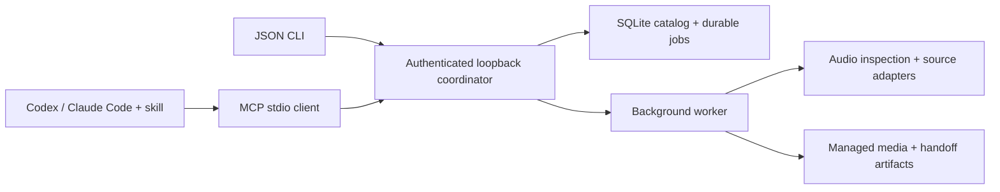

# DJ Library Tool

[](https://github.com/uneasymusings/dj-library-tool/actions/workflows/quality.yml)

**From a tracklist to a ready crate in rekordbox, using the music you already own.**

`djlib` is a local-first prep engine for DJs. Paste a set's tracklist or a request list; it tells you which songs you own, which are missing, and where you only have a different mix. It builds the crate in list order, prepares working copies for rekordbox or Serato, and brings rekordbox's BPM and key analysis back so you can sort and filter. Drive it from the terminal, or let Claude Code or Codex drive it through MCP. Your music, catalog and jobs never leave your computer.

```text
$ djlib requests create --text "Set Zero.txt"
⣠⣴⣿⣦⣄ Set Zero — Friday  6 songs
  4 owned  ·  1 missing  ·  1 unknown ID

#   Status         Requested                                Match
1   ✓ owned        Nia Okoro - Slow Burn                    House/Nia Okoro - Slow Burn.flac
2   ✓ owned        Velvet Static - Night Bus (Extended Mix) House/Velvet Static - Night Bus (Ex…
3   ✗ missing      Velvet Static - Night Bus (Dub)          you own: Extended Mix, Radio Edit
4   ○ unknown ID   ID - ID  @ 31:40
…

$ djlib import-rekordbox ~/Desktop/rekordbox.xml    # BPM/key from rekordbox's own analysis
$ djlib requests collect REQUEST_ID                  # owned songs → crate, in set order
$ djlib rekordbox push ID                            # playlist in rekordbox, analyzed, verified
```

The headline workflow, step by step:

| Step | Command | What happens |
| --- | --- | --- |
| Index | `djlib init --allow-root ~/Music` then `djlib scan` | Reads tags in place; nothing is moved or retagged. |
| Ask | `djlib requests create --text tracklist.txt` | Each line becomes a request: owned, missing, other version owned, or unknown ID. |
| Analyze | `djlib import-rekordbox rekordbox.xml` | rekordbox's BPM and key land in the catalog, matched by exact file path. |
| Crate | `djlib requests collect ID` | Owned songs become an ordered collection; missing ones stay listed. |
| Push | `djlib rekordbox push ID` | On macOS, djlib drives rekordbox's own File menu: imports the crate as a playlist of your original files, waits for rekordbox's analysis, verifies the playlist from rekordbox's XML export and pulls BPM/key back. |
| Hand off | `djlib delivery plan …`, `delivery prepare`, `delivery observe` | Separate tagged working copies for rekordbox/Serato or USB delivery, with guided checks. |

`rekordbox push` needs a one-time macOS permission (System Settings → Privacy & Security → Accessibility → your terminal app). It uses only rekordbox's menus (Import Playlist, Export Collection in xml format) and never reads or writes rekordbox's database; before any keystroke it checks that rekordbox and the expected dialog have focus.

In a terminal you get tables, live progress and copy-pasteable next steps; piped or with `--json` every command prints a stable JSON envelope for scripts and assistants. Native import, analysis and USB export still happen in rekordbox or Serato; djlib prepares files and records what you confirm.

> **Experimental alpha, 0.1.0a7.** This release adds the tracklist-to-crate workflow, rekordbox analysis import, the terminal experience and the local review page. Like a6, it is checked by all six OS/Python release jobs and an installed-wheel MCP smoke test. Real-music import in Serato and physical USB/player export remain unverified. See [publication status, evidence and limits](docs/STATUS.md).

[DJ delivery](docs/DJ_DELIVERY.md) freezes selected collections, prepares separate app working copies, and records native-stage observations. App-only `rekordbox_import` and `serato_import` need no USB or player model; standalone USB delivery remains a separate target-specific workflow with read-only device checks. The API exposes 42 MCP tools (a6: 40). See the [requirement and public-release audit](docs/COVERAGE.md).

## Your first useful session

Install the public release below, create separate library/session directories, then tell the assistant:

> Use my allowed music folder to make a three-track Warm Groove collection in Serato [or rekordbox]. Check existing recordings and versions first. Prepare separate working copies, help me import and analyze them, and show what remains unchecked. I do not know the player model yet.

The assistant handles request files and job IDs. Start with a few owned tracks and a named collection, check their membership and loading in the app, then expand. A player model is needed for a standalone USB target, not for organizing your app library. Demo tones can validate installation before you supply real music roots. For a deadline, prepare the accepted selection and retain a separate missing-track report; unfinished acquisition does not have to delay that selection.

## What is here

| Workflow | Current implementation |
| --- | --- |
| Existing music | Scan allowed folders; inspect audio; index original files in place. |
| Catalog maintenance | Page through recordings and saved work; explicitly add music roots; reconcile changed file bytes without silently replacing pinned history. |
| Collections | Plan explicit local tracklists; keep requested versions; reuse identical bytes; review metadata conflicts. |
| Selected web recordings | Optional yt-dlp adapter for public YouTube, SoundCloud, and Bandcamp URLs; durable per-track jobs. |
| Set links | Read publisher descriptions and chapters for the assistant to interpret. Audio recognition is planned. |
| Agent operation | JSON CLI, MCP stdio, and [portable skill](skills/dj-library/SKILL.md). No model API key required by the engine. |
| DJ handoff | Hash-checked manifest, M3U playlist, and experimental rekordbox XML. |
| USB preflight | Read capacity and mount status; no device writes or compatibility claim. |
| Target delivery | App-first import/analysis plans without hardware prerequisites; separate USB workflows, isolated copies, sourced format profiles, operator observations and read-only verification. |
| Request coverage | Persist exact song/version requests and unknown IDs; hash-check local matches and save missing/ambiguous reports. Source selection is separate from acquisition. |
| DJ organization | Read tagged metadata, save byte-bound notes/categories with provenance, and build ordered collections from explicit catalog selections. No automatic musical inference or native database edits. |
| Native rekordbox snapshot | Compare a native Collection XML export with prepared paths and playlist membership/order. Snapshot inspection never grants readiness or proves analysis accuracy. |

Soulseek through slskd, complete artist catalog workflows, acoustic track identification, musical analysis, native Serato/rekordbox automation, automatically verified player-ready USB export, and the early-web public home remain in the [full implementation plan](PLAN.md). There is no frontend yet.

## Install from GitHub

The commands below target the [v0.1.0a7 release assets](https://github.com/uneasymusings/dj-library-tool/releases/tag/v0.1.0a7), including the engine, MCP server and matching skill. Check [status](docs/STATUS.md) for publication and public-installation evidence. No clone or developer checkout is required. Install [uv](https://docs.astral.sh/uv/getting-started/installation/) first:

```bash
uv tool install --python 3.13 'dj-library-tool[download] @ https://github.com/uneasymusings/dj-library-tool/releases/download/v0.1.0a7/dj_library_tool-0.1.0a7-py3-none-any.whl'
djlib version
```

Then create a new music workspace and a separate assistant session. On macOS/Linux:

```bash
djlib --workspace "$HOME/djlib-library" init --allow-root "$HOME/Music"
djlib --workspace "$HOME/djlib-library" setup-agent --output "$HOME/djlib-session"
python3 "$HOME/djlib-session/launch.py" codex
# Or replace codex with claude.
```

Use your actual music folder and new workspace/session paths. The installed package copies both skills and supplies explicit MCP configuration. Your chosen AI CLI must be installed and signed in. FFmpeg/ffprobe remain separate requirements; YouTube needs supported Deno or Node 22+. See [public installation](docs/INSTALL.md) for Windows, PATH, skill-only installation, and updates. Music and the engine run locally; GitHub distributes the software.

## Develop from source

Requires Python 3.12+ and [uv](https://docs.astral.sh/uv/getting-started/installation/). There is no published PyPI release yet.

```bash
git clone https://github.com/uneasymusings/dj-library-tool.git
cd dj-library-tool
uv sync --locked
```

For web source inspection and downloads:

```bash
uv sync --locked --extra download
```

Install FFmpeg/ffprobe separately for compressed formats and downloads. YouTube needs a supported JavaScript runtime: the adapter checks versions and selects supported Deno first, then supported Node (yt-dlp requires Node 22+). It does not install a runtime. See [yt-dlp's EJS guidance](https://github.com/yt-dlp/yt-dlp/wiki/EJS).

## Try the local workflow

The demo generates three original one-second tones, builds a collection, and prepares export artifacts. It uses no accounts, music websites, DJ app databases, or USB device. Choose a new directory. With the installed release, run:

```bash
djlib --workspace ./demo-workspace demo
djlib --workspace ./demo-workspace library
djlib --workspace ./demo-workspace service stop
```

For your own music, initialize a separate workspace and explicitly allow the music directory:

```bash
djlib --workspace /path/to/dj-workspace init --allow-root /path/to/music
djlib --workspace /path/to/dj-workspace scan /path/to/music --key first-library-scan
djlib --workspace /path/to/dj-workspace jobs list
```

In a terminal, commands print readable views (from a7; a6 prints JSON everywhere):

```text
$ djlib --workspace ~/dj-workspace library --query "night bus"
Artist          Title                      Time   Format     File
───────────────────────────────────────────────────────────────────────────────────────
Velvet Static   Night Bus (Extended Mix)   6:52   MP3 320k   House/Velvet Static - Night…
Velvet Static   Night Bus (Radio Edit)     3:43   MP3 320k   House/Velvet Static - Night…

2 of 2 tracks
```

Submissions such as `scan`, `start`, `export` and `delivery prepare` follow their job with a live progress bar (Ctrl-C only stops watching) and end with copy-pasteable next steps. In a terminal `--key` is optional, `scan` defaults to your only music folder, and `delivery observe ID` asks what you saw in the app instead of requiring a JSON file. Search ignores case and accents and matches every word.

`djlib ui` opens a local review page in your browser: search the library with BPM/key readouts, see which requested songs you own, pick between versions, build a crate from what you own, and follow each delivery's checklist. It is served by the same background service on `127.0.0.1` and opened with a private link; nothing leaves your computer.

Output is the JSON envelope whenever it is piped or captured by an assistant, or with `--json` (`DJLIB_OUTPUT=json` also works); scripts must pass explicit `--key` values. Help and argument parsing follow Typer conventions. Accepted jobs belong to a detached local coordinator and are designed to continue when the CLI/MCP client exits. Commands never silently rewrite your original audio tags. [Quickstart](docs/QUICKSTART.md) covers request files, progress, conflict reviews, and exports.

For an actual DJ destination, use the [native app delivery workflow](docs/DJ_DELIVERY.md). Start with a small app pilot; choose the separate target-specific USB route when device delivery is needed. An M3U or copied audio folder is prepared material; the native app must create its playlists, device library or portable crates.

If the immediate request is “put this in rekordbox/Serato,” start with `rekordbox_import` or `serato_import`. A delivery request specifies accepted collection IDs, the actual app version, and default preservation of source format. No hardware profile is required. Follow the [app-first example](docs/INSTALL.md#prepare-an-app-before-choosing-a-player). In a6, organization, successful analysis/native-export observations and app verification return jobs. Wait for completion and inspect the receipt, then read the delivery evidence and its check time. Rereading a saved receipt or delivery does not perform another check.

Since a6, full local preparation is permitted before physical testing. Omit `pilot_delivery_id` to prepare with an explicit unvalidated-pilot state; a supplied pilot must be successful and match the target. App/USB readiness still requires its native and verification stages. Pilot and full deliveries use separate working paths, so cues or analysis on pilot copies do not automatically transfer.

## Use with an AI CLI

For a separate trial session, initialize a workspace (or run the demo), then:

```bash
djlib --workspace /absolute/path/dj-workspace setup-agent \
  --output /absolute/path/dj-session
cd /absolute/path/dj-session
python launch.py codex
# or: python launch.py claude
```

The generated project includes both skills, MCP configuration, and launchers using the installed Python's absolute path. Existing output directories are preserved. Your host must already be installed and signed in. Use a Python executable available on your platform (`python3` where needed). These launchers do not edit your personal host configuration. Codex interactive retains personal settings; `launch.py codex exec ...` ignores personal config. Claude uses only the explicit MCP config. Don't disable project settings if you want Claude's skill discovery.

On Windows, run `launch.py` from an external terminal: it starts the coordinator before the AI host. With manual MCP configuration, first run `djlib --workspace PATH service start` externally. Windows MCP cold start returns `COORDINATOR_START_REQUIRED`; see [Windows setup](docs/INSTALL.md#create-your-library-and-assistant-session).

To register the tools permanently instead, use absolute paths:

```bash
# Codex
codex mcp add djlib -- /absolute/path/to/installed/djlib \
  --workspace /absolute/path/dj-workspace mcp serve

# Claude Code
claude mcp add --transport stdio djlib -- /absolute/path/to/installed/djlib \
  --workspace /absolute/path/dj-workspace mcp serve
```

Find the executable with `command -v djlib` or PowerShell `(Get-Command djlib).Source`. Add the [skill](skills/dj-library) to your host's skill directory for the workflow guidance. See [agent setup](docs/AGENTS.md) for installation, MCP configuration, and example requests.

Example request:

> Use djlib to build a Friday warm-up collection from my existing music. Inspect this set's description for IDs, keep the unknown ones in a missing-track report, and download the individual recordings I select. Prepare a rekordbox import and check the free space on my USB.

The assistant can use its own search tools to find candidate recordings. `djlib` does not yet search the web or automatically recognize every track in a set. Web audio is labeled as having unverified source quality; converting it to FLAC does not improve fidelity.

The intended result is a usable supervised alpha: give the assistant set links or exact requests, check owned recordings, acquire selected sources, organize accepted tracks and follow the native app handoff. A release passing its engineering checks does not mean your whole library has been organized or your USB is ready. The next practical step remains a small owned-music trial with your actual roots; device delivery additionally needs the volume, target and observed native export/playback. Unknown tracks and unfinished stages remain visible as you scale.

## Architecture



One coordinator owns a workspace. Preferences are profiles within that workspace, so two assistants cannot accidentally start independent writers for the same catalog. Recordings, immutable byte revisions, physical file locations, and collection membership are separate entities.

Read the [architecture and decisions](docs/ARCHITECTURE.md), [CLI/API contract](docs/CONTRACT.md), and [full product plan](PLAN.md).

## Development

```bash
uv sync --locked --extra download
uv run pytest -q
uv run ruff check src scripts tests
uv run ruff format --check src scripts tests
uv build
```

CI is configured for runtime tests, lint, formatting, and packaging on Linux, macOS, and Windows with Python 3.12/3.13. The workflow installs and requires FFmpeg/ffprobe on every matrix runner; tests can still skip when those tools are absent from an independently configured environment. Provider tests in CI use controlled fixtures; actual CI outcomes and host/provider/app checks are recorded separately in the [validation guide](docs/VALIDATION.md). See [contributing](CONTRIBUTING.md) and [security](SECURITY.md).

MIT licensed. Music remains local; users supply their own sources and download rights. Independent project; no affiliation with Serato, AlphaTheta/rekordbox, Soulseek, or the supported assistant hosts.
