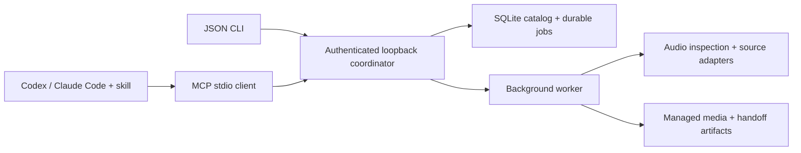

# DJ Library Tool

[](https://github.com/uneasymusings/dj-library-tool/actions/workflows/quality.yml)

**Turn music requests into traceable DJ collections, using your existing AI assistant.**

`djlib` is a local Python engine with a JSON CLI, MCP tools, and a portable skill for Codex and Claude Code. Your assistant handles conversation and discovery; the engine handles persistent work, file validation, collection membership, and app handoff artifacts.

> **Experimental first implementation, 0.1.0a1.** Dependency installation, static lint, formatting, and skill structure have been checked. End-to-end execution, live downloads, native DJ app import, and hardware compatibility have not yet been verified. See [status](docs/STATUS.md) before using a real library.

## What is here

| Workflow | Current implementation |
| --- | --- |
| Existing music | Scan allowed folders; inspect audio; index original files in place. |
| Collections | Plan explicit local tracklists; keep requested versions; reuse identical bytes; review metadata conflicts. |
| Selected web recordings | Optional yt-dlp adapter for public YouTube, SoundCloud, and Bandcamp URLs; durable per-track jobs. |
| Set links | Read publisher descriptions and chapters for the assistant to interpret. Audio recognition is planned. |
| Agent operation | JSON CLI, MCP stdio, and [portable skill](skills/dj-library/SKILL.md). No model API key required by the engine. |
| DJ handoff | Hash-checked manifest, M3U playlist, and experimental rekordbox XML. |
| USB preflight | Read capacity and mount status; no device writes or compatibility claim. |

Soulseek through slskd, complete artist catalog workflows, acoustic track identification, musical analysis, native Serato/rekordbox automation, player-ready USB export, and the early-web public home remain in the [full implementation plan](PLAN.md). There is no frontend yet.

## Install from source

Requires Python 3.12+ and [uv](https://docs.astral.sh/uv/getting-started/installation/). There is no published PyPI release yet.

```bash
git clone https://github.com/uneasymusings/dj-library-tool.git
cd dj-library-tool
uv sync --locked
```

For web source inspection and downloads:

```bash
uv sync --locked --extra download
```

Install FFmpeg/ffprobe separately for compressed formats and downloads. YouTube extraction may also require a supported JavaScript runtime; this project does not install one automatically. See [yt-dlp's dependency guidance](https://github.com/yt-dlp/yt-dlp#dependencies).

## Try the local workflow

The demo generates three original one-second tones, builds a collection, and prepares export artifacts. It uses no accounts, music websites, DJ app databases, or USB device. Choose an empty directory:

```bash
uv run djlib --workspace ./demo-workspace demo
uv run djlib --workspace ./demo-workspace library
uv run djlib --workspace ./demo-workspace service stop
```

For your own music, initialize a separate workspace and explicitly allow the music directory:

```bash
uv run djlib --workspace /path/to/dj-workspace init --allow-root /path/to/music
uv run djlib --workspace /path/to/dj-workspace scan /path/to/music --key first-library-scan
uv run djlib --workspace /path/to/dj-workspace jobs list
```

Every command emits JSON. Accepted jobs belong to a detached local coordinator and are designed to continue when the CLI/MCP client exits. Commands never silently rewrite your original audio tags. [Quickstart](docs/QUICKSTART.md) covers request files, progress, conflict reviews, and exports.

## Use with an AI CLI

Initialize your workspace, then register the executable from this checkout using absolute paths:

```bash
# Codex
codex mcp add djlib -- /absolute/path/dj-library-tool/.venv/bin/djlib \
  --workspace /absolute/path/dj-workspace mcp serve

# Claude Code
claude mcp add --transport stdio djlib -- /absolute/path/dj-library-tool/.venv/bin/djlib \
  --workspace /absolute/path/dj-workspace mcp serve
```

On Windows, use `.venv\Scripts\djlib.exe`. Add the [skill](skills/dj-library) to your host's skill directory for the workflow guidance. See [agent setup](docs/AGENTS.md) for installation, MCP configuration, and example requests.

Example request:

> Use djlib to build a Friday warm-up collection from my existing music. Inspect this set's description for IDs, keep the unknown ones in a missing-track report, and download the individual recordings I select. Prepare a rekordbox import and check the free space on my USB.

The assistant can use its own search tools to find candidate recordings. `djlib` does not yet search the web or automatically recognize every track in a set. Web audio is labeled as having unverified source quality; converting it to FLAC does not improve fidelity.

## Architecture



One coordinator owns a workspace. Preferences are profiles within that workspace, so two assistants cannot accidentally start independent writers for the same catalog. Recordings, immutable byte revisions, physical file locations, and collection membership are separate entities.

Read the [architecture and decisions](docs/ARCHITECTURE.md), [CLI/API contract](docs/CONTRACT.md), and [full product plan](PLAN.md).

## Development

```bash
uv sync --locked --extra download
uv run ruff check src scripts
uv run ruff format --check src scripts
uv build
```

CI currently checks static quality and packaging on Linux, macOS, and Windows. Runtime tests, failure injection, agent evaluations, and actual app/device validation are scheduled in the plan; they are not represented by this CI badge or the available command list. See [contributing](CONTRIBUTING.md) and [security](SECURITY.md).

MIT licensed. Music remains local; users supply their own sources and download rights. Independent project; no affiliation with Serato, AlphaTheta/rekordbox, Soulseek, or the supported assistant hosts.
