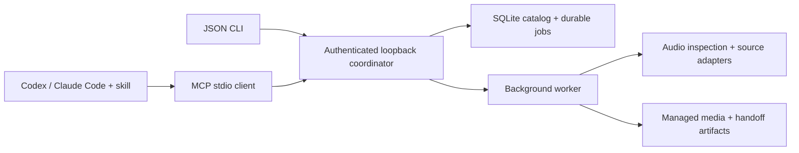

# DJ Library Tool

[](https://github.com/uneasymusings/dj-library-tool/actions/workflows/quality.yml)

**Turn music requests into traceable DJ collections, using your existing AI assistant.**

`djlib` is a local Python engine with a JSON CLI, MCP tools, and a portable skill for Codex and Claude Code. Your assistant handles conversation and discovery; the engine handles persistent work, file validation, collection membership, and app handoff artifacts.

> **Experimental alpha, 0.1.0a3.** This version adds supervised app delivery, exact-request coverage, catalog annotations and read-only native XML inspection. Serato import and physical USB/player export remain unverified. See [publication status, evidence and limits](docs/STATUS.md).

[DJ delivery](docs/DJ_DELIVERY.md) freezes selected collections, prepares separate app working copies, and records native-stage observations. App-only `rekordbox_import` and `serato_import` need no USB or player model; standalone USB delivery remains a separate target-specific workflow with read-only device checks. Native import/analysis/export still happen in rekordbox or Serato. The current API exposes 34 MCP tools. See the [requirement and public-release audit](docs/COVERAGE.md).

## What is here

| Workflow | Current implementation |
| --- | --- |
| Existing music | Scan allowed folders; inspect audio; index original files in place. |
| Collections | Plan explicit local tracklists; keep requested versions; reuse identical bytes; review metadata conflicts. |
| Selected web recordings | Optional yt-dlp adapter for public YouTube, SoundCloud, and Bandcamp URLs; durable per-track jobs. |
| Set links | Read publisher descriptions and chapters for the assistant to interpret. Audio recognition is planned. |
| Agent operation | JSON CLI, MCP stdio, and [portable skill](skills/dj-library/SKILL.md). No model API key required by the engine. |
| DJ handoff | Hash-checked manifest, M3U playlist, and experimental rekordbox XML. |
| USB preflight | Read capacity and mount status; no device writes or compatibility claim. |
| Target delivery | App-first import/analysis plans without hardware prerequisites; separate USB workflows, isolated copies, sourced format profiles, operator observations and read-only verification. |
| Request coverage | Persist exact song/version requests and unknown IDs; hash-check local matches and save missing/ambiguous reports. Source selection is separate from acquisition. |
| DJ organization | Read tagged metadata, save byte-bound notes/categories with provenance, and build ordered collections from explicit catalog selections. No automatic musical inference or native database edits. |
| Native rekordbox snapshot | Compare a native Collection XML export with prepared paths and playlist membership/order. Snapshot inspection never grants readiness or proves analysis accuracy. |

Soulseek through slskd, complete artist catalog workflows, acoustic track identification, musical analysis, native Serato/rekordbox automation, automatically verified player-ready USB export, and the early-web public home remain in the [full implementation plan](PLAN.md). There is no frontend yet.

## Install from GitHub

The commands below target the [v0.1.0a3 release assets](https://github.com/uneasymusings/dj-library-tool/releases/tag/v0.1.0a3), including the engine, MCP server, and portable skill; see [status](docs/STATUS.md) for publication and validation state. No clone or developer checkout is required. Install [uv](https://docs.astral.sh/uv/getting-started/installation/) first:

```bash
uv tool install --python 3.13 'dj-library-tool[download] @ https://github.com/uneasymusings/dj-library-tool/releases/download/v0.1.0a3/dj_library_tool-0.1.0a3-py3-none-any.whl'
djlib version
```

Then create a new music workspace and a separate assistant session. On macOS/Linux:

```bash
djlib --workspace "$HOME/djlib-library" init --allow-root "$HOME/Music"
djlib --workspace "$HOME/djlib-library" setup-agent --output "$HOME/djlib-session"
python3 "$HOME/djlib-session/launch.py" codex
# Or replace codex with claude.
```

Use your actual music folder and new workspace/session paths. The installed package copies both skills and supplies explicit MCP configuration. Your chosen AI CLI must be installed and signed in. FFmpeg/ffprobe remain separate requirements; YouTube needs supported Deno or Node 22+. See [public installation](docs/INSTALL.md) for Windows, PATH, skill-only installation, and updates. Music and the engine run locally; GitHub distributes the software.

## Develop from source

Requires Python 3.12+ and [uv](https://docs.astral.sh/uv/getting-started/installation/). There is no published PyPI release yet.

```bash
git clone https://github.com/uneasymusings/dj-library-tool.git
cd dj-library-tool
uv sync --locked
```

For web source inspection and downloads:

```bash
uv sync --locked --extra download
```

Install FFmpeg/ffprobe separately for compressed formats and downloads. YouTube needs a supported JavaScript runtime: the adapter checks versions and selects supported Deno first, then supported Node (yt-dlp requires Node 22+). It does not install a runtime. See [yt-dlp's EJS guidance](https://github.com/yt-dlp/yt-dlp/wiki/EJS).

## Try the local workflow

The demo generates three original one-second tones, builds a collection, and prepares export artifacts. It uses no accounts, music websites, DJ app databases, or USB device. Choose an empty directory:

```bash
uv run djlib --workspace ./demo-workspace demo
uv run djlib --workspace ./demo-workspace library
uv run djlib --workspace ./demo-workspace service stop
```

For your own music, initialize a separate workspace and explicitly allow the music directory:

```bash
uv run djlib --workspace /path/to/dj-workspace init --allow-root /path/to/music
uv run djlib --workspace /path/to/dj-workspace scan /path/to/music --key first-library-scan
uv run djlib --workspace /path/to/dj-workspace jobs list
```

Application commands emit JSON; help and argument parsing follow Typer conventions. Accepted jobs belong to a detached local coordinator and are designed to continue when the CLI/MCP client exits. Commands never silently rewrite your original audio tags. [Quickstart](docs/QUICKSTART.md) covers request files, progress, conflict reviews, and exports.

For an actual DJ destination, use the [native app delivery workflow](docs/DJ_DELIVERY.md). Start with a small app pilot; choose the separate target-specific USB route when device delivery is needed. An M3U or copied audio folder is prepared material; the native app must create its playlists, device library or portable crates.

If the immediate request is “put this in rekordbox/Serato,” start with `rekordbox_import` or `serato_import`. A delivery request specifies the accepted `collection_ids`, actual `app_version`, and default `audio_mode: "preserve"`; no hardware profile is required. `delivery plan --file app-trial.json` and `delivery prepare DELIVERY_ID --revision CURRENT_REVISION --key app-trial-v1` prepare the separate copies. After native import/analysis observations, `delivery verify-app` refreshes working-file evidence. This is app readiness, not USB readiness. [App-first example](docs/INSTALL.md#prepare-an-app-before-choosing-a-player).

## Use with an AI CLI

For a separate trial session, initialize a workspace (or run the demo), then:

```bash
djlib --workspace /absolute/path/dj-workspace setup-agent \
  --output /absolute/path/dj-session
cd /absolute/path/dj-session
python launch.py codex
# or: python launch.py claude
```

The generated project includes both skills, MCP configuration, and launchers using the installed Python's absolute path. Existing output directories are preserved. Your host must already be installed and signed in. Use a Python executable available on your platform (`python3` where needed). These launchers do not edit your personal host configuration. Codex interactive retains personal settings; `launch.py codex exec ...` ignores personal config. Claude uses only the explicit MCP config. Don't disable project settings if you want Claude's skill discovery.

To register the tools permanently instead, use absolute paths:

```bash
# Codex
codex mcp add djlib -- /absolute/path/to/installed/djlib \
  --workspace /absolute/path/dj-workspace mcp serve

# Claude Code
claude mcp add --transport stdio djlib -- /absolute/path/to/installed/djlib \
  --workspace /absolute/path/dj-workspace mcp serve
```

Find the executable with `command -v djlib` or PowerShell `(Get-Command djlib).Source`. Add the [skill](skills/dj-library) to your host's skill directory for the workflow guidance. See [agent setup](docs/AGENTS.md) for installation, MCP configuration, and example requests.

Example request:

> Use djlib to build a Friday warm-up collection from my existing music. Inspect this set's description for IDs, keep the unknown ones in a missing-track report, and download the individual recordings I select. Prepare a rekordbox import and check the free space on my USB.

The assistant can use its own search tools to find candidate recordings. `djlib` does not yet search the web or automatically recognize every track in a set. Web audio is labeled as having unverified source quality; converting it to FLAC does not improve fidelity.

## Architecture



One coordinator owns a workspace. Preferences are profiles within that workspace, so two assistants cannot accidentally start independent writers for the same catalog. Recordings, immutable byte revisions, physical file locations, and collection membership are separate entities.

Read the [architecture and decisions](docs/ARCHITECTURE.md), [CLI/API contract](docs/CONTRACT.md), and [full product plan](PLAN.md).

## Development

```bash
uv sync --locked --extra download
uv run pytest -q
uv run ruff check src scripts tests
uv run ruff format --check src scripts tests
uv build
```

CI is configured for runtime tests, lint, formatting, and packaging on Linux, macOS, and Windows with Python 3.12/3.13. The workflow installs and requires FFmpeg/ffprobe on every matrix runner; tests can still skip when those tools are absent from an independently configured environment. Provider tests in CI use controlled fixtures; actual CI outcomes and host/provider/app checks are recorded separately in the [validation guide](docs/VALIDATION.md). See [contributing](CONTRIBUTING.md) and [security](SECURITY.md).

MIT licensed. Music remains local; users supply their own sources and download rights. Independent project; no affiliation with Serato, AlphaTheta/rekordbox, Soulseek, or the supported assistant hosts.
