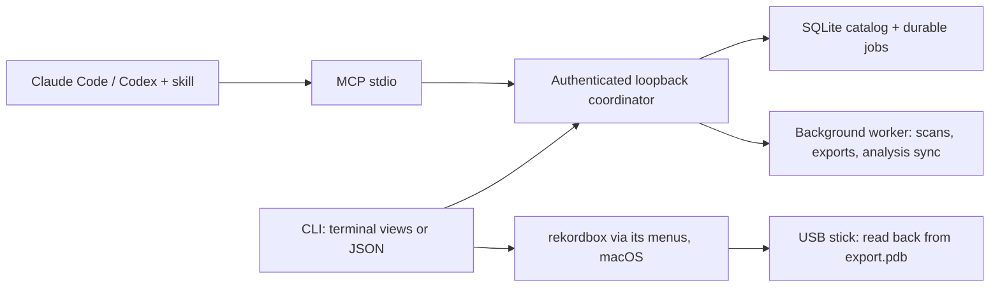

# DJ Library Tool

[](https://github.com/uneasymusings/dj-library-tool/actions/workflows/quality.yml)

**From a tracklist to a verified USB stick, using the music you already own.**

`djlib` is a local-first prep tool for rekordbox DJs. Give it a set's tracklist and it tells you which songs you own, which are missing and where you only have a different mix. It builds the crate in set order, puts it into rekordbox and, with one click from you, onto your USB stick. Then it reads the stick back to prove every track is there, in order, byte for byte. Use it from the terminal, or let Claude Code or Codex drive it through MCP. Your music and catalog never leave your computer.

```text
$ djlib set Friday.txt --usb
→ In rekordbox, click the playlist Friday — Warm-up. djlib exports it as soon as it is selected.
✓ Friday — Warm-up  12 of 15 songs owned
  Crate      12 tracks, in set order
  rekordbox  ✓ playlist “Friday — Warm-up” imported
  USB        ✓ RICARDO_AM: 12 of 12 in the player's library, in order and byte for byte

Not in the crate (3)
 #   Status         Requested                You own
 4   ✗ missing      Lumen - Halo (Dub)       Radio Edit
 9   ✗ missing      Someone - Not Owned
13   ○ unknown ID   ID - ID @ 41:20
```

> **Experimental alpha, 0.1.0a11.** Checked on macOS, Linux and Windows with Python 3.12 and 3.13, and live against rekordbox 7.2.19 with a real library and USB stick. Playback on CDJ/XDJ hardware is not verified by the tool, so test your stick before a gig. Evidence and limits are in [status](docs/STATUS.md).

## Quick start

```bash
curl -LsSf https://raw.githubusercontent.com/uneasymusings/dj-library-tool/main/install.sh | sh
```

The installer sets up [uv](https://docs.astral.sh/uv/) if needed, installs the newest djlib release and FFmpeg (through Homebrew when available), and runs `djlib doctor`. Later, `djlib upgrade` updates it. Then:

```bash
djlib init --allow-root ~/Music      # creates and remembers your workspace
djlib scan                           # indexes your music in place
djlib set tracklist.txt              # owned/missing → crate → rekordbox playlist
djlib set tracklist.txt --usb        # … and onto your USB stick, verified
djlib status                         # library, request lists, crates, next steps
```

Prefer to do it by hand? `brew install ffmpeg`, then `uv tool install --python 3.13 'dj-library-tool[download] @ https://github.com/uneasymusings/dj-library-tool/releases/download/v0.1.0a11/dj_library_tool-0.1.0a11-py3-none-any.whl'`.

A tracklist is plain text with one `Artist - Title (Mix)` per line. Numbering, timestamps and `[Label]` suffixes are ignored, and a heading line names the set. Start without `--usb` to see what you own; add it when the stick is plugged in.

`set` works without rekordbox: `--no-rekordbox` only checks the tracklist and builds the crate, and on Linux and Windows (or without rekordbox installed) the rekordbox step is skipped with the reason shown. rekordbox automation needs macOS and a one-time permission: System Settings → Privacy & Security → Accessibility → your terminal app. See [installation](docs/INSTALL.md) for PATH, Linux/Windows, updates and uninstalling.

## How it works

| Step | Command | What happens |
| --- | --- | --- |
| All at once | `djlib set tracklist.txt [--fetch] [--usb]` | Runs the steps below. Without `--usb` it stops at the rekordbox playlist; `--no-rekordbox` stops at the crate, and `--when-idle 60` waits until you're away to import. Running it again re-checks the list and reuses the crate and playlist; a changed set becomes “Name (2)”. |
| From a link | `djlib set https://soundcloud.com/…` | A YouTube or SoundCloud set: its description or chapters become the tracklist, and listener comments around each “ID” are shown as hints. 1001Tracklists only serves browsers, so copy its tracklist into a file or let your assistant read it in your browser. |
| Missing songs | `--fetch` | Searches YouTube and SoundCloud, downloads clear matches as MP3 after you confirm (official uploads first; previews, live versions, full sets and unrequested remixes skipped), then fills the set. Unclear ones are listed with the best guess. Web audio is the source's quality; you are responsible for having the rights. |
| Index | `djlib scan` | Reads tags, or “Artist - Title” file names, in place. Nothing is moved or retagged. Rescans only decode new bytes. |
| Ask | `djlib requests create --text tracklist.txt` | Each line becomes owned, missing, other version owned, or unknown ID. Matching uses exact artist/title/version labels and is hash-checked; a different mix is never swapped in. |
| Crate | `djlib requests collect ID` | Owned songs become a collection in set order; missing ones stay listed (`requests report` saves them). |
| rekordbox | `djlib rekordbox push ID [--when-idle 60]` | Imports the crate as a playlist of your original files through rekordbox's File > Import > Import Playlist, so existing analysis and cues are kept. Takes a few seconds; with `--when-idle`, only once you've stepped away. |
| Analysis | `djlib rekordbox sync` (automatic) | BPM and cue counts are read from rekordbox's own analysis files in the background, with no window. `rekordbox pull` adds musical key through one brief XML export. |
| USB | `djlib rekordbox usb ID` | You click the playlist once. djlib confirms it is the right one and runs Playlist > Export Playlist > your stick. It then reads the playlist from the stick's device library (`export.pdb`, what CDJs load) and checks each entry, in order, against your files' SHA-256. |

### How djlib drives rekordbox

- **Only rekordbox's own menus and dialogs.** djlib never reads or writes rekordbox's database. Before any keystroke it checks that rekordbox and the expected dialog have focus, and otherwise cancels.
- **One click for USB.** rekordbox's browser can't be scripted, so you select the playlist when asked. djlib reads which one is selected from rekordbox's export dialog and exports nothing else.
- **Your screen stays yours.** Analysis is read from files in the background. `--when-idle` defers pushes until you're away, and a locked screen just means "wait".
- **Read-back, not trust.** Pushes are confirmed from rekordbox's playlist menu, or from its XML export with `--verify`. USB exports are confirmed from the stick itself. djlib never writes the stick; rekordbox does.

## In the terminal, for scripts, and in the browser

In a terminal every command prints a readable view, with live progress for long jobs and copy-pasteable next steps. Piped, captured, or with `--json`, every command prints the same stable JSON envelope instead. `djlib ui` opens a private local review page with library search and BPM/key, request lists with version picks, crate building, and delivery checklists.

## Use with an AI assistant

Install the engine (Quick start above), then add the plugin. It brings the MCP server and a [skill](skills/dj-library/SKILL.md) that teaches the workflow, including computer etiquette: idle-time pushes, batching, no UI polling.

```bash
# Claude Code
claude plugin marketplace add uneasymusings/dj-library-tool
claude plugin install djlib@dj-library-tool

# Codex
codex plugin marketplace add uneasymusings/dj-library-tool
codex plugin add djlib@dj-library-tool
```

Then ask, for example:

> Here's tonight's tracklist. Check what I own, tell me what's missing and which other versions I have, and put the set on my USB through rekordbox.

The assistant runs `djlib set` in the background on your Mac and tells you which playlist to click for the USB export. The MCP server offers the core tools (tracklists, crates, set links, downloads, rekordbox analysis) by default; `DJLIB_MCP_TOOLS=full` adds delivery and organize tools.

Without the plugin, register the server yourself (`--scope user` makes it available in every project) and copy the skill as described in [agent setup](docs/AGENTS.md):

```bash
claude mcp add --scope user --transport stdio djlib -- "$(command -v djlib)" mcp serve
codex mcp add djlib -- "$(command -v djlib)" mcp serve
```

Or try it in a separate session without touching your host settings: `djlib setup-agent --output ~/djlib-session`, then `python3 ~/djlib-session/launch.py claude`.

## More

- **Web downloads** need the `download` extra (included in the install command above) and FFmpeg. Downloads are MP3 and labelled as unverified source quality. See [quickstart](docs/QUICKSTART.md).
- **Delivery workflows.** Separate, tagged working copies with guided native-app and USB checks for when you don't want to export your originals: [DJ delivery](docs/DJ_DELIVERY.md). Serato working copies are supported there but untested with real music.
- **Try it without your music.** `djlib --workspace ./demo demo` builds a collection from three generated tones.
- **Step by step.** Request lists, notes and BPM/key filters, JSON input files and the other commands: [advanced use](docs/ADVANCED.md) and [troubleshooting](docs/TROUBLESHOOTING.md).

## Architecture



One coordinator owns a workspace and exits after 30 idle minutes when it was started implicitly. Recordings, immutable byte revisions, file locations and collection membership are separate entities, so a renamed or retagged file never silently changes a crate. Read the [architecture](docs/ARCHITECTURE.md), the [CLI/API contract](docs/CONTRACT.md), [coverage](docs/COVERAGE.md) and the [product plan](PLAN.md).

## Development

Requires Python 3.12+ and uv.

```bash
git clone https://github.com/uneasymusings/dj-library-tool.git && cd dj-library-tool
uv sync --locked --extra download
uv run pytest -q
uv run ruff check src scripts tests && uv run ruff format --check src scripts tests
```

CI runs tests, lint, formatting and packaging on Linux, macOS and Windows with Python 3.12 and 3.13; tagged releases are built and checked before publishing. See [validation](docs/VALIDATION.md), [contributing](CONTRIBUTING.md) and [security](SECURITY.md).

MIT licensed. Music stays local; you supply your own sources and download rights. Independent project, not affiliated with AlphaTheta/rekordbox, Serato, or the supported assistant hosts.
