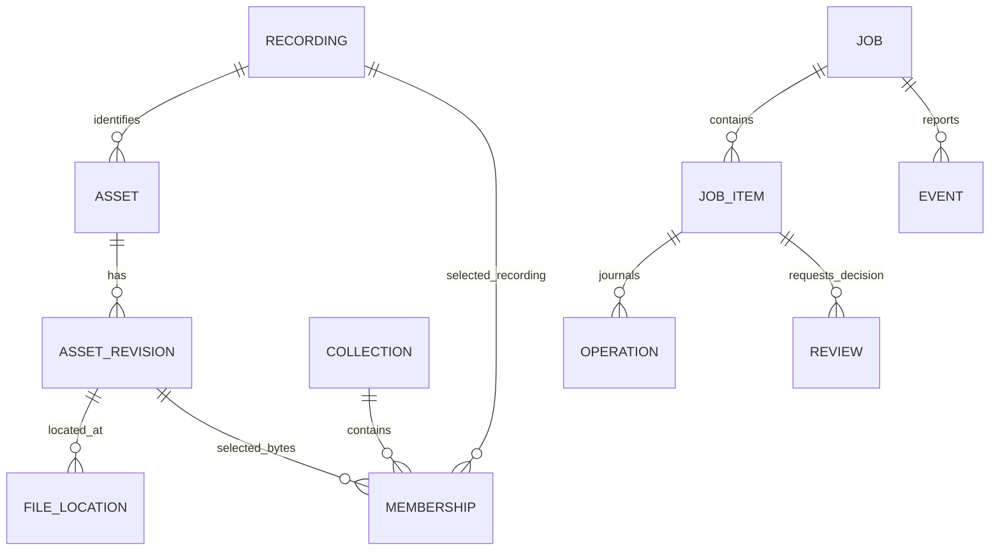
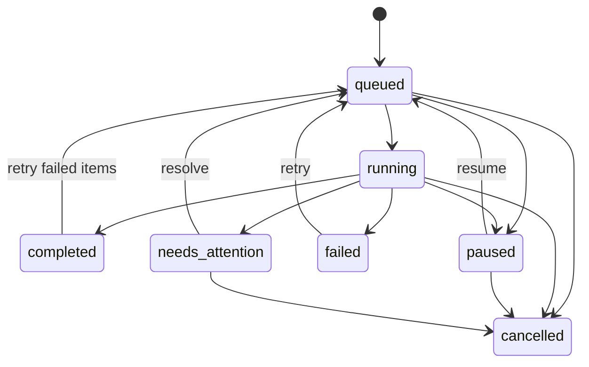

# Architecture and decisions

This document describes **0.1.0a9**, adding catalog reconciliation/discovery and durable native checks. Earlier a3 added delivery, request tracking, annotations and native snapshots to a2. Implementation, validation and publication evidence are distinguished in [status](STATUS.md).

## Execution boundary

The application is a Python modular monolith. CLI and MCP are adapters around an authenticated loopback HTTP coordinator. One coordinator holds a per-workspace file lock and owns scheduling and catalog mutations. A startup lock serializes discovery and process creation. An ephemeral port avoids hardcoded port collisions; discovery verifies a private runtime record against a token-authenticated health response and workspace/instance IDs.

Windows MCP is discovery-only when no coordinator exists: it returns `COORDINATOR_START_REQUIRED`. The generated launcher starts the service before the AI host, or the user starts it from an external terminal with `service start`. This keeps coordinator lifetime outside the host SDK's Windows Job Object. No job escape or lifecycle-policy bypass is attempted. This boundary addresses the unpublished a4 candidate's confirmed cold-start lifetime defect; a6 validation is recorded separately.

Coordinator startup serializes on a 45-second lock and waits up to 30 seconds for authenticated health. One attempt spawns at most one child. Lock contention, an exited child without a healthy service, and an alive child without readiness return distinct busy/failed/timeout errors. A timeout does not kill the startup process or submit the caller's requested music operation; inspect status/logs before retrying.

The coordinator runs a FastAPI/Uvicorn event loop. Database transactions are short and synchronous. Within durable jobs, blocking audio decoding, hashing, and file copies run in threads without a database session. Organization, passed analysis/native-export observations and app verification use per-item jobs; individual metadata/annotation operations and bounded request-ledger checks remain synchronous. yt-dlp runs as an isolated subprocess with bounded metadata output, timeouts, and a staging-growth monitor. Client exit does not own job cancellation.

There is one active worker per workspace. Item-boundary requeueing provides fair scheduling across waiting jobs; persisted queue timestamps preserve peer ordering across restarts. A bounded preference keeps handoff work responsive without indefinitely starving acquisitions. Parallel provider workers, provider-specific concurrency limits and background recognition workers remain future work.

## Code map

| Package | Responsibility |
| --- | --- |
| `domain` | Strict public input contracts, label normalization, typed failures. |
| `application` | Plans, job submission, idempotency, review decisions, collection/catalog queries. |
| `persistence` | SQLAlchemy models, Alembic migration history, transactions. |
| `jobs` | Worker, state checkpoints, generation fencing, ingestion journal, export preparation. |
| `audio` | Complete decoding, measured properties, byte hashes, embedded labels. |
| `sources` | Optional web metadata and selected-download adapter. |
| `exporting` | Atomic handoff documents, isolated app working copies, documented hardware profiles, and bounded read-only device inspection. |
| `interfaces` | JSON CLI, MCP client adapter, loopback server/client lifecycle. |

## Catalog model

A named recording identity is a conservative normalized artist/title/version tuple. New incomplete-label indexing uses provisional byte identity, and symbol-only distinctions are preserved. Existing incorrect merges are not automatically repaired. Neither form is an acoustic fingerprint. A byte revision has a unique SHA-256 hash and immutable measured properties. File locations and collection membership are independent, so identical bytes can be reused without copying. New indexing retains a decoded-payload baseline for explicit tag-only reconciliation, not for acoustic song recognition.

Collection membership chooses one revision per recording and does not automatically choose a better edition. If several locations exist for those bytes, exports prefer managed storage. Missing locations remain visible with unavailable evidence. Catalog/saved-work listing uses query-bound keyset cursors and an insertion cutoff; metadata and location state remain current rather than transaction-frozen. Quality-based upgrade selection remains future work.

Explicit reconciliation pins a catalog revision and the changed path's new SHA-256. `tag_only` requires unchanged decoded payload and stream format, keeps recording/asset identity and adds a byte revision. Legacy revisions need a baseline or another verified original-byte location. `replace_audio` uses exact known bytes or a new provisional identity. Neither mutates audio or transfers prior annotations/memberships to the new revision. Old location history is retained; affected request matches and delivery evidence are invalidated, and historical export receipts gain a stale marker rather than being rewritten.

Web assets retain source URL, conversion evidence, unverified source quality, and unverified acoustic identity. Selected FLAC downloads receive chosen artist/title/version tags on a staged managed copy; full decoding and hashing run again before that copy is promoted. The acquisition bytes remain unchanged in `incoming/`, with their hash retained in provenance. Generated tags are supplied display labels, not independent identity evidence. External user files retain their source path and original tags.

## Durable jobs

`completed` carries either `complete` or `completed_with_gaps`. A job can be complete with failed/skipped items; the assistant must examine outcome and counts. Empty scans complete with no tracks. Review decisions are revision-checked. Cancellation is terminal and preserves accepted assets; a new intent is needed to restart cancelled work.

The diagram's retry transition is not universal. Committed annotation/organization transactions and completed organization jobs are terminal. A delivery-check job that committed evidence is terminal even when that evidence records failure. Read the current delivery/annotation revision and submit a new explicit intent instead of reopening committed history.

Idempotency is scoped to the workspace. A key stores a semantic request hash and the accepted job ID in the same transaction. Repeating the exact request returns that job; reusing its key with another request returns a conflict. Collection starts include the plan ID and frozen profile. Export requests freeze the current collection, so a changed collection requires a new export key.

Every attempt has a generation number. Pause/cancel/retry advances it, and later worker commits check the job state and generation. On service restart, running items become pending. Managed destinations use the revision hash, allowing a retry to reconcile a file promoted before a catalog commit. The operation journal records planned/staged/committed/failed phases; it is not yet a general rollback engine.

## File boundaries

Workspaces have explicit allowed source roots. Additive root updates validate existing directories and preserve prior permissions; repeated initialization rejects newly requested roots rather than silently ignoring them. Source symlinks resolve before authorization. Managed media and handoff documents use predictable IDs/hash names; publisher strings never become filesystem paths. Original sources are reused unless the selected profile copies them.

Audio inspection streams complete WAV payloads, or uses ffprobe plus bounded full FFmpeg decoding for other supported formats. Source size/mtime is checked around inspection. Copies are hashed before atomic promotion. Export hashes are checked again before artifact generation. These measures detect changed bytes, but do not prove authenticity, lossless origin, or acoustic identity.

## Target delivery and the native app boundary

`Delivery` persists a request, collection/recording snapshot, preparation job, revision and evidence. `rekordbox_import` and `serato_import` need no hardware or USB. Separate `rekordbox_usb` and `serato_portable` track device delivery; only standalone rekordbox USB requires a documented player profile. The app version and audio mode are part of the request. Pilots sample collections round-robin. Full local preparation may omit a pilot with explicit unvalidated status; a supplied pilot must match and pass. All readiness gates remain. Pilot/full copies use separate paths with no native cue/history reuse. See [DJ delivery](DJ_DELIVERY.md).

Preparation runs through durable jobs and writes separate working audio, M3U8 membership lists, a hash-checked delivery manifest and native instructions inside the workspace export directory. Original catalog files remain unchanged. Preservation is the default; MP3 or WAV compatibility conversions require an explicit mode. Plans freeze explicit annotation values/revisions in `dj_metadata`; preparation writes supplied BPM/key/genre and descriptive comments to working copies while the manifest retains provenance. Fractional MP4 BPM uses an exact freeform value rather than rounding the integer tempo field, with a native-display warning. Writing supplied tags does not perform acoustic analysis. Full decoding, measured format checks and hashes establish preparation, not native app import or player compatibility.

Native app actions belong to rekordbox or Serato. The engine does not implement a native export CLI, synthesize native crates/device databases, or write to the bound USB. Typed operator observations record `imported`, `analyzed`, `native_exported`, `device_library_checked`, and `hardware_playback` in order. Passing observations must cover frozen recording IDs and playlist counts; full hardware playback may use an explicitly reported sample. Revision checks prevent stale updates, but do not independently authenticate the operator's claims. Replacing earlier evidence or rebinding a device invalidates dependent evidence.

Read-only native rekordbox XML inspection compares a supported Collection export with exact prepared paths and playlist membership/order. It checks the declared product version, reports raw BPM/key and unknowns, and never changes delivery evidence/readiness or opens referenced media. Bounded snapshot parsing is separate from live native state, musical accuracy and device verification. Operator annotations may explicitly cite the snapshot checksum/version; this is not `native_tag` evidence from catalog originals.

App-only workflows require the first two native observations plus `verify-app`, which rechecks working audio and refreshes the recorded post-analysis file hashes. Completion returns a delivery ID/revision/evidence-commit receipt, never `ready_for_app_use`. Saved delivery status exposes `app_requirements_met_at_last_check` and the app-readback timestamp; it does not rehash files or imply USB readiness. App input format profiles are separate from player profiles. Serato's documented format families are paired with explicit conservative engine bounds, not invented vendor sample-rate maxima.

Passing rekordbox hardware observations also require a matching `hardware_profile`, an actual `firmware_version`, and `storage_recognized: true`. The CDJ-3000 profile rejects withdrawn firmware 3.30 after whitespace/case/optional `v` normalization. These are validations of operator-supplied evidence, not direct hardware queries.

Analysis reconciliation is limited to isolated working copies. Matching whole-file hashes take a fast path; changed copies undergo fresh stream-property and decoded-PCM hash checks before post-analysis hashes are accepted. Passed analysis/native-export observations and app verification queue per-track jobs; intent-derived keys make retries stable. Native-export checks require exact analyzed bytes and validate the bound volume at acceptance and finalization. Deferred finalization rechecks file identity signatures and atomically fences evidence/revision updates against job generation, pause and cancellation. Saved completed receipts identify committed evidence; the delivery retains its check time, not ongoing freshness. This does not parse native analysis; explicit catalog reconciliation is a separate operation.

Device inspection reads mount/identity metadata and bounded audio hashes without following symlinks, Windows reparse points or nested volumes. POSIX traversal uses descriptor-relative no-follow opens; Windows uses relative native opens beneath held directory handles. File observations use comparable path/handle identities, with no timestamp-only fallback. Native database names are existence markers, never parsed integrity or playlist evidence. Stronger volume identities use macOS `diskutil` or the Windows mount manager's volume GUID; failed queries and other platforms retain a weak fallback, insufficient for the readiness gate. Windows filesystem names and MBR/GPT partition style can be queried through a bounded metadata-only native child process; unsupported or failed partition queries preserve known volume GUID/filesystem evidence and leave the style unknown. FAT/exFAT legacy identity handling is conservatively guarded; runner tests do not establish physical USB compatibility. Limits, scan failures and missing hashes are reported. The status endpoint does not rehash: fresh departure evidence comes from explicit `verify-device` and remains conditional on operator reports and hardware sampling.

Hardware profiles carry primary-document references, exact known format limits, explicit unknowns, and false firmware/hardware-verification flags. The engine conservatively assesses only known mono/stereo channel counts and checks a supplied output extension against the codec's supported suffixes. Those checks do not validate every container header or establish an exhaustive manufacturer channel-layout limit. Their assessment is not a player certification. OneLibrary/Device Library selection follows [AlphaTheta's export guidance](https://cdn.rekordbox.com/files/20260318114024/OneLibrary-Compatible-USB-Device-Export_en.pdf); portable Serato copying follows the [native Files/crate workflow](https://support.serato.com/hc/en-us/articles/202304844-Using-a-USB-external-hard-drive-for-your-portable-library). Neither is replaced by generic audio copies or interchange XML.

## Decisions

| Decision | Reason and consequence |
| --- | --- |
| Existing LLM host first | Delivers conversational use without maintaining model credentials, an agent loop, or a frontend. A standalone chat adapter remains planned. |
| CLI + MCP share HTTP use cases | Both clients see the same accepted jobs and typed contracts. Coordinator lifecycle is additional operational complexity. |
| One workspace, several profiles | Preferences don't split catalog identity or create multiple writers. |
| SQLite + Alembic | Easy local ownership and versioned migration history. Schema upgrades first save integrity-checked catalog backups; automatic restore and broader media/native backups remain outside scope. |
| SQLite DELETE journal | A single scheduler does not need WAL; avoids platform-specific WAL handling. Multiple remote users are outside this release's model. |
| Byte hashes and versioned identity | Distinguishes duplicate files from requested recording versions; acoustic fingerprints are a separate later capability. |
| yt-dlp as optional subprocess | Keeps provider churn and dependencies away from core installation. Public-source extraction can still break or be unavailable. |
| App-owned native delivery | Isolated artifacts and explicit evidence support supervised native app work. Device hashes cannot prove playlist references or physical playback; native actions remain outside the engine. |
| No frontend initially | Product effort goes to reusable tooling and actual DJ workflow reliability. The requested public home is scheduled later. |

The XML writer follows [AlphaTheta's published interchange format](https://cdn.rekordbox.com/files/20200410160904/xml_format_list.pdf), including its explicit `file://localhost/` location convention. Remote/UNC locations must first be copied into local managed storage. Format conformance is not app compatibility evidence.

## Known engineering gaps

Native target-delivery trials are outstanding; runtime evidence is tracked in [status](STATUS.md). Integrity-checked catalog backups precede schema upgrades, but automatic restore is not implemented. Remaining gaps include staging garbage collection, automatic expired-service log rotation, provider rate-limit scheduler, filesystem power-loss durability proof, deterministic cancellation of in-flight threads, audio fingerprints, or live DJ database adapters. SQLite catalog hashes become stale when a user retags an external file; export rejects that file and asks for reconciliation. Explicit catalog reconciliation is implemented with conservative revision/history boundaries; it does not automatically repair historical identity merges, migrate old annotations/memberships, or choose quality upgrades. The [plan](../PLAN.md) specifies the full release gates.
