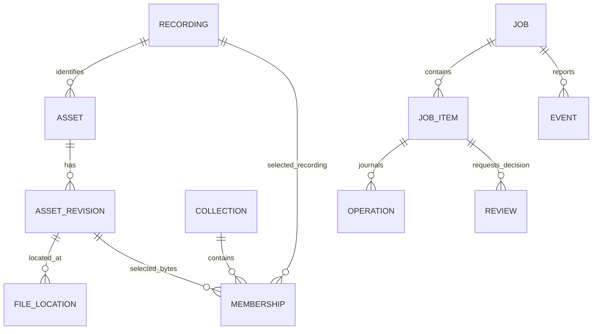
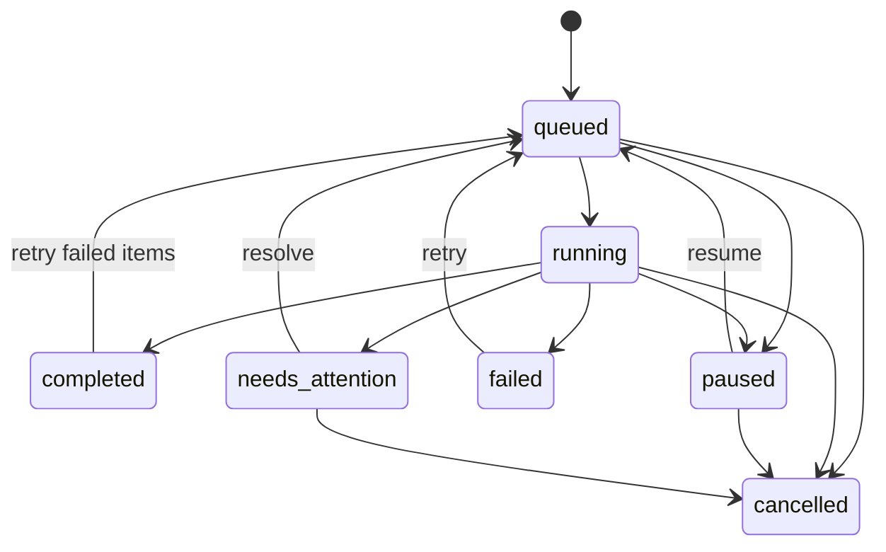

# Architecture and decisions

## Execution boundary

The application is a Python modular monolith. CLI and MCP are adapters around an authenticated loopback HTTP coordinator. One coordinator holds a per-workspace file lock and owns scheduling and catalog mutations. A startup lock serializes discovery and process creation. An ephemeral port avoids hardcoded port collisions; discovery verifies a private runtime record against a token-authenticated health response and workspace/instance IDs.

The coordinator runs a FastAPI/Uvicorn event loop. Database transactions are short and synchronous. Blocking audio decoding, hashing, and file copies run in threads without a database session. yt-dlp runs as an isolated subprocess with bounded metadata output, timeouts, and a staging-growth monitor. Client exit does not own job cancellation.

This first version has one active worker per workspace. It prioritizes predictable state over maximum bulk throughput. Provider concurrency limits, fair scheduling, and background recognition workers come later.

## Code map

| Package | Responsibility |
| --- | --- |
| `domain` | Strict public input contracts, label normalization, typed failures. |
| `application` | Plans, job submission, idempotency, review decisions, collection/catalog queries. |
| `persistence` | SQLAlchemy models, Alembic migration history, transactions. |
| `jobs` | Worker, state checkpoints, generation fencing, ingestion journal, export preparation. |
| `audio` | Complete decoding, measured properties, byte hashes, embedded labels. |
| `sources` | Optional web metadata and selected-download adapter. |
| `exporting` | Atomic handoff documents and read-only storage preflight. |
| `interfaces` | JSON CLI, MCP client adapter, loopback server/client lifecycle. |

## Catalog model

A recording identity is a conservative normalized artist/title/version tuple. It is not an acoustic fingerprint. A byte revision has a unique SHA-256 hash and immutable measured properties. File locations and collection membership are independent, so identical bytes can be reused without copying or adding a track twice to the same collection. Current byte-level identity includes existing embedded tags; audio-only equivalence is later work.

Collection membership chooses one revision per recording. It currently keeps the first accepted revision rather than automatically choosing a better edition. If multiple locations exist for those bytes, exports prefer managed storage. Missing-path fallback and quality-based upgrade reconciliation remain future work.

Web assets retain source URL, conversion evidence, unverified source quality, and unverified acoustic identity. External user files retain their source path. Original tags are read but never rewritten.

## Durable jobs

`completed` carries either `complete` or `completed_with_gaps`. A job can be complete with failed/skipped items; the assistant must examine outcome and counts. Empty scans complete with no tracks. Review decisions are revision-checked. Cancellation is terminal and preserves accepted assets; a new intent is needed to restart cancelled work.

Idempotency is scoped to the workspace. A key stores a semantic request hash and the accepted job ID in the same transaction. Repeating the exact request returns that job; reusing its key with another request returns a conflict. Collection starts include the plan ID and frozen profile. Export requests freeze the current collection, so a changed collection requires a new export key.

Every attempt has a generation number. Pause/cancel/retry advances it, and later worker commits check the job state and generation. On service restart, running items become pending. Managed destinations use the revision hash, allowing a retry to reconcile a file promoted before a catalog commit. The operation journal records planned/staged/committed/failed phases; it is not yet a general rollback engine.

## File boundaries

Workspaces have explicit allowed source roots. Source symlinks resolve before authorization. Managed media and handoff documents use predictable IDs/hash names; publisher strings never become filesystem paths. Original sources are reused unless the selected profile copies them.

Audio inspection streams complete WAV payloads, or uses ffprobe plus bounded full FFmpeg decoding for other supported formats. Source size/mtime is checked around inspection. Copies are hashed before atomic promotion. Export hashes are checked again before artifact generation. These measures detect changed bytes, but do not prove authenticity, lossless origin, or acoustic identity.

## Decisions

| Decision | Reason and consequence |
| --- | --- |
| Existing LLM host first | Delivers conversational use without maintaining model credentials, an agent loop, or a frontend. A standalone chat adapter remains planned. |
| CLI + MCP share HTTP use cases | Both clients see the same accepted jobs and typed contracts. Coordinator lifecycle is additional operational complexity. |
| One workspace, several profiles | Preferences don't split catalog identity or create multiple writers. |
| SQLite + Alembic | Easy local ownership and versioned migration history. Backups and migration recovery need further implementation. |
| SQLite DELETE journal | A single scheduler does not need WAL; avoids platform-specific WAL handling. Multiple remote users are outside this release's model. |
| Byte hashes and versioned identity | Distinguishes duplicate files from requested recording versions; acoustic fingerprints are a separate later capability. |
| yt-dlp as optional subprocess | Keeps provider churn and dependencies away from core installation. Public-source extraction can still break or be unavailable. |
| Artifacts before native automation | Creates an inspectable first handoff. Compatibility cannot be claimed until app import is exercised. |
| No frontend initially | Product effort goes to reusable tooling and actual DJ workflow reliability. The requested public home is scheduled later. |

The XML writer follows [AlphaTheta's published interchange format](https://cdn.rekordbox.com/files/20200410160904/xml_format_list.pdf), including its explicit `file://localhost/` location convention. Remote/UNC locations must first be copied into local managed storage. Format conformance is not app compatibility evidence.

## Known engineering gaps

Runtime validation is outstanding. There are no implemented migrations backup/restore, staging garbage collection, automatic expired-service log rotation, provider rate-limit scheduler, filesystem power-loss durability proof, deterministic cancellation of in-flight threads, audio fingerprints, or live DJ database adapters. SQLite catalog hashes become stale when a user retags an external file; export rejects that file and asks for reconciliation, but revision reconciliation is not implemented yet. The [plan](../PLAN.md) specifies the full release gates.
